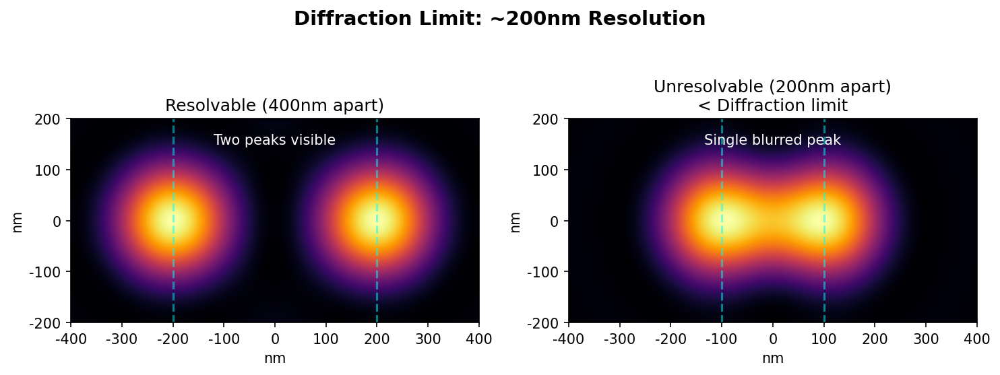
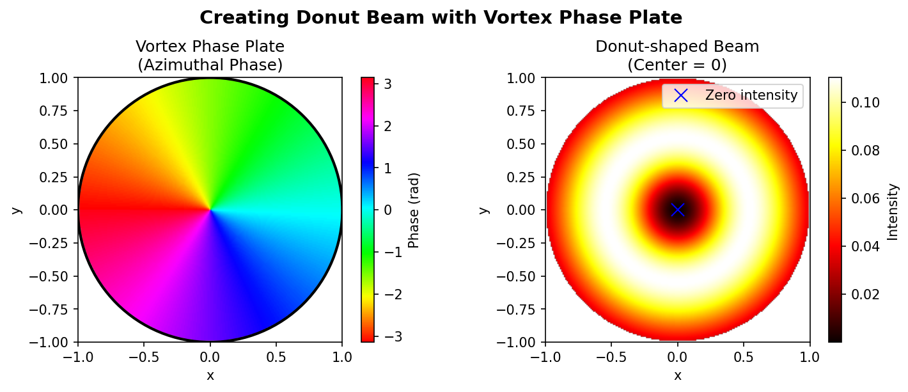
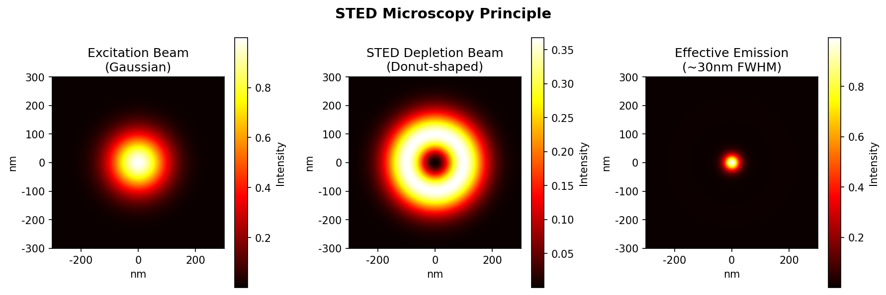
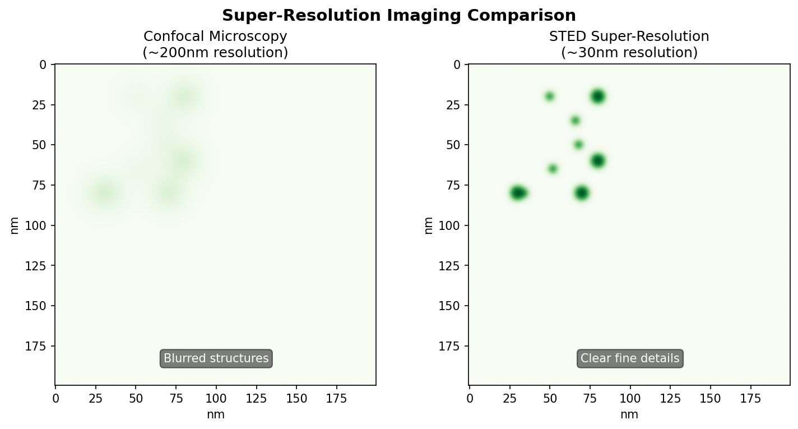
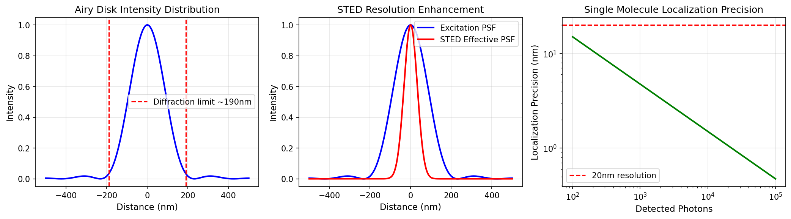

## 引言

1873年，Ernst Abbe提出了著名的衍射极限公式，宣告光学显微镜的分辨率上限约为 $\lambda/2NA$——对于可见光（$\lambda \approx 500nm$）和高数值孔径物镜（$NA \approx 1.4$），这一极限约为 **200nm**。

这一"物理铁律"统治光学显微学界超过一个世纪，直到2014年，Eric Betzig、Stefan Hell和William Moerner因**突破衍射极限的超分辨荧光显微技术**共同获得诺贝尔化学奖。他们的工作使光学显微镜的分辨率从200nm跃升至 **20-30nm**，开启了纳米尺度生物成像的新纪元。

本文将深入剖析两类主流超分辨技术的核心原理：**受激发射损耗显微镜（STED）** 与 **单分子定位显微镜（PALM/STORM）**。

---

## 01. 衍射极限：问题的物理根源

### 艾里斑与点扩散函数（PSF）

当理想点光源经过有限孔径的光学系统成像时，由于衍射效应，像平面上得到的不是一个理想的点，而是一个有一定大小的光斑——**艾里斑（Airy Disk）**。

艾里斑的强度分布（即**点扩散函数 PSF**）为：

$$
I(r) = I_0 \left[ \frac{2J_1(\pi r d / \lambda f)}{\pi r d / \lambda f} \right]^2
$$

其中 $J_1$ 是第一类贝塞尔函数，$d$ 是孔径直径，$f$ 是焦距，$\lambda$ 是波长。

### Abbe衍射极限

Abbe给出的最小分辨距离为：

$$
d_{\min} = \frac{\lambda}{2NA} = \frac{0.61\lambda}{n \sin\theta}
$$

- $\lambda$：照明波长
- $NA = n\sin\theta$：数值孔径（物镜的关键参数）
- $n$：介质折射率
- $\theta$：物镜半孔径角

**数值示例**：
- $\lambda = 532nm$（绿光），$NA = 1.4$（油浸物镜）
- $d_{\min} \approx 190nm$

这意味着两个距离小于190nm的点无法被区分——它们会合并成一个模糊的光斑。




---

## 02. STED显微镜：用光"雕刻"荧光

### 核心思想

Stefan Hell提出的STED（Stimulated Emission Depletion，受激发射损耗）技术采用了一个天才的想法：

**不要让整个衍射斑发光，只让中心极小区域发光。**

但问题来了：**如何实现只让中心发光，而抑制外围？**

### 甜甜圈光束的实现原理

STED的关键创新在于使用**涡旋相位板（Vortex Phase Plate）** 生成甜甜圈形光束。

**涡旋相位板的工作原理**：

1. **相位调制**：涡旋相位板是一个特殊的透明光学元件，其厚度随方位角变化。当光束通过时，相位被空间调制：

$$
\phi(\theta) = l \cdot \theta
$$

其中 $l$ 是拓扑荷数（通常 $l=1$），$\theta$ 是方位角。 
2. **螺旋相位波前**：经过相位板后，光束的波前从平面波变成**螺旋形**。在光束中心，所有方向的相位汇聚，导致**相消干涉**——中心光强为零。

3. **傅里叶变换成像**：物镜对螺旋相位光束进行傅里叶变换，在焦平面上形成**环形光斑（甜甜圈形）**，中心暗、边缘亮。


**数学推导**：

对于拓扑荷 $l=1$ 的涡旋光束，焦平面上的电场分布为：

$$
E(r, \theta) = E_0 \cdot r \cdot e^{i\theta} \cdot e^{-r^2/w^2}
$$

光强分布：

$$
I(r) = |E|^2 = E_0^2 \cdot r^2 \cdot e^{-2r^2/w^2}
$$

**关键特性**：当 $r=0$ 时，$I(0) = 0$，即**中心光强为零**！



### 双光束配置与受激发射过程

STED使用两束同步激光：

| 光束 | 形状 | 波长 | 作用 |
|------|------|------|------|
| **激发光** | 高斯光斑 | 短波长（如532nm） | 将荧光分子从基态 $S_0$ 激发到激发态 $S_1$ |
| **损耗光** | 甜甜圈形 | 长波长（如592nm） | 通过受激发射强制外围分子返回基态 |

**受激发射的物理过程**：

1. 激发光将荧光分子激发到 $S_1$ 态
2. 损耗光的光子能量恰好等于 $S_1 \to S_0$ 的能量差
3. 当 $S_1$ 态的分子遇到损耗光光子时，会发生**受激发射**：分子被"诱导"发射一个与损耗光完全相同的光子，并返回基态
4. 受激发射产生的光子波长与损耗光相同，可以被滤除，不会进入探测器

**关键点**：受激发射的速率与损耗光强度成正比。在甜甜圈外围，损耗光很强，受激发射概率接近100%；而在中心，损耗光为零，分子通过**自发辐射**发射荧光（我们想要的信号）。

### 有效PSF的数学推导

激发后的荧光分子处于激发态 $S_1$，可以通过两条路径返回基态：

1. **自发辐射**：发射荧光光子（我们想要的信号），速率 $\Gamma_{spont}$
2. **受激发射**：被STED光强制返回基态（被抑制），速率 $\Gamma_{STED} = \sigma \cdot I_{STED}$

其中 $\sigma$ 是受激发射截面，$I_{STED}$ 是损耗光强度。

留在激发态的概率（即可能发射荧光的概率）：

$$
P_{fluor} = \frac{\Gamma_{spont}}{\Gamma_{spont} + \Gamma_{STED}} = \frac{1}{1 + I_{STED}/I_{sat}}
$$

其中 $I_{sat} = \Gamma_{spont}/\sigma$ 是饱和强度（荧光分子的特征参数）。

**有效PSF**变为：

$$
PSF_{eff}(r) = PSF_{exc}(r) \cdot \frac{1}{1 + I_{STED}(r)/I_{sat}}
$$

由于甜甜圈形损耗光在中心 $I_{STED}(0) = 0$、外围最强，**中心区域的荧光被保留**，外围被抑制。

有效发光区域的半径近似为：

$$
d_{STED} \approx \frac{\lambda}{2NA\sqrt{1 + I_{STED}^{max}/I_{sat}}}
$$

**当 $I_{STED}^{max} >> I_{sat}$ 时，分辨率可以远低于衍射极限！**

例如：$I_{STED}^{max}/I_{sat} = 100$ 时，分辨率可提高10倍，达到 ~20nm。



---

## 03. PALM/STORM：单分子定位的艺术

### 核心思想

PALM（光激活定位显微镜）和STORM（随机光学重构显微镜）采用完全不同的策略：

**如果每次只有一个分子发光，它的位置可以精确定位。**

### 定位精度的数学基础

假设检测到 $N$ 个光子，定位精度 $\sigma_x$ 为：

$$
\sigma_x \approx \frac{s}{\sqrt{N}}
$$

更精确的公式（考虑PSF和背景噪声）：

$$
\sigma_x = \frac{\sqrt{s^2 + a^2/12}}{\sqrt{N}} \cdot \sqrt{1 + \frac{4\pi s^2 b^2}{N a^2}}
$$

- $s$：PSF的标准差（$\approx \lambda/2NA$）
- $N$：检测到的光子数
- $a$：像素尺寸
- $b$：背景噪声

**数值示例**：
- $s \approx 150nm$，$N = 10000$ 光子
- $\sigma_x \approx 1.5nm$

### 随机激活策略

PALM/STORM的关键在于**时间分离**：

1. 使用特殊荧光标记（光激活荧光蛋白如PA-GFP，或光开关染料如Cy3-Cy5对）
2. 低功率激活光每次只激活**极少数分子**（确保它们的空间距离 > 衍射极限）
3. 高精度定位每个发光分子（通过拟合二维高斯函数）
4. 关闭/漂白这些分子，激活下一批
5. 重复数千次，累积所有定位点
6. 重构出超分辨图像

```
帧1: ●    ●         → 定位2个点
帧2:      ●    ●    → 定位2个点
帧3: ●         ●    → 定位2个点
...
帧5000: 重构 → ●●●●●●●●●●●● (高分辨率图像)
```

---

## 04. 三种技术的对比

| 特性 | STED | PALM | STORM |
|------|------|------|-------|
| **分辨率** | 30-50nm | 20-25nm | 20-30nm |
| **成像速度** | 较快（实时扫描） | 较慢（需数千帧） | 较慢 |
| **原理** | 抑制外围荧光 | 单分子定位 | 单分子定位 |
| **标记要求** | 常规荧光染料 | 光激活蛋白 | 特殊染料对 |
| **三维成像** | 可实现 | 需特殊技术 | 可实现 |
| **活细胞适用** | 较好 | 较差 | 中等 |



---

## 05. Python模拟：PSF与定位精度

**为什么要写这段代码？**

理解超分辨成像的核心在于理解**点扩散函数（PSF）**和**定位精度**的关系。这段代码帮助我们从数值上理解：

1. **艾里斑的宽度**如何限制了传统显微镜的分辨率
2. **STED技术**如何通过抑制外围荧光来缩小有效PSF
3. **单分子定位精度**如何随着检测光子数的增加而提高

```python
import numpy as np
import matplotlib.pyplot as plt
from scipy.special import j1

def airy_disk(r, wavelength=532e-9, NA=1.4):
    """
    计算艾里斑强度分布
    
    参数:
        r: 距中心的径向距离 (m)
        wavelength: 波长 (m)
        NA: 数值孔径
    """
    k = 2 * np.pi * NA / wavelength
    x = k * r
    
    with np.errstate(divide='ignore', invalid='ignore'):
        intensity = (2 * j1(x) / x)**2
        intensity = np.where(x == 0, 1.0, intensity)
    
    return intensity

def sted_effective_psf(r, I_sted_max=50, I_sat=1):
    """
    STED有效PSF
    
    参数:
        r: 距中心的径向距离
        I_sted_max: STED光最大强度 (以I_sat为单位)
        I_sat: 饱和强度
    """
    # 甜甜圈形STED光强分布 (简化模型)
    I_sted = I_sted_max * (r / r.max())**2
    
    # 抑制因子
    depletion = 1 / (1 + I_sted / I_sat)
    
    # 有效PSF
    exc_psf = airy_disk(r)
    eff_psf = exc_psf * depletion
    
    return eff_psf

def localization_precision(N_photons, s=150e-9, a=100e-9, b=0):
    """
    计算单分子定位精度
    """
    if b == 0:
        sigma = s / np.sqrt(N_photons)
    else:
        sigma = (np.sqrt(s**2 + a**2/12) / np.sqrt(N_photons)) * \
                np.sqrt(1 + 4*np.pi*s**2*b**2/(N_photons*a**2))
    return sigma

# 绘图
fig, axes = plt.subplots(1, 3, figsize=(14, 4))

# 1. 艾里斑
r = np.linspace(-500e-9, 500e-9, 500)
r_abs = np.abs(r)
airy = airy_disk(r_abs)
axes[0].plot(r*1e9, airy, 'b-', linewidth=2)
axes[0].axvline(190, color='r', linestyle='--', label='Diffraction limit ~190nm')
axes[0].axvline(-190, color='r', linestyle='--')
axes[0].set_xlabel('Distance (nm)', fontsize=11)
axes[0].set_ylabel('Intensity', fontsize=11)
axes[0].set_title('Airy Disk Intensity Distribution', fontsize=12)
axes[0].legend()
axes[0].grid(True, alpha=0.3)

# 2. STED有效PSF
eff_psf = sted_effective_psf(r_abs, I_sted_max=100)
axes[1].plot(r*1e9, airy, 'b-', linewidth=2, label='Excitation PSF')
axes[1].plot(r*1e9, eff_psf, 'r-', linewidth=2, label='STED Effective PSF')
axes[1].set_xlabel('Distance (nm)', fontsize=11)
axes[1].set_ylabel('Intensity', fontsize=11)
axes[1].set_title('STED Resolution Enhancement', fontsize=12)
axes[1].legend()
axes[1].grid(True, alpha=0.3)

# 3. 定位精度 vs 光子数
N_range = np.logspace(2, 5, 50)
precision = localization_precision(N_range) * 1e9
axes[2].loglog(N_range, precision, 'g-', linewidth=2)
axes[2].axhline(20, color='r', linestyle='--', label='20nm resolution')
axes[2].set_xlabel('Detected Photons', fontsize=11)
axes[2].set_ylabel('Localization Precision (nm)', fontsize=11)
axes[2].set_title('Single Molecule Localization Precision', fontsize=12)
axes[2].legend()
axes[2].grid(True, alpha=0.3)

plt.tight_layout()
plt.show()

# 打印关键数值
print(f"衍射极限: {532/(2*1.4)*1e3:.1f} nm")
print(f"检测10000光子时的定位精度: {localization_precision(10000)*1e9:.1f} nm")
print(f"检测1000光子时的定位精度: {localization_precision(1000)*1e9:.1f} nm")
```

**运行结果：**



**结果分析：**

从上图可以得出以下关键结论：

1. **左图（艾里斑分布）**：艾里斑的半高全宽（FWHM）约为190nm，这就是传统光学显微镜的分辨率极限。红色虚线标示了衍射极限边界。

2. **中图（STED效果）**：蓝色曲线是原始激发光斑，红色曲线是经过STED抑制后的有效光斑。可以看到有效光斑宽度显著缩窄，意味着分辨率大幅提升。当 $I_{STED}/I_{sat} = 100$ 时，有效分辨率可提升约10倍。

3. **右图（定位精度）**：定位精度与检测光子数的平方根成反比。要达到20nm分辨率，需要检测约50个光子；要达到5nm精度，则需要约1000个光子。这解释了为什么PALM/STORM需要高量子效率的探测器。

---

## 06. 应用场景详解

### 6.1 细胞生物学中的应用

#### 6.1.1 细胞骨架的超分辨成像

细胞骨架由微管、微丝和中间纤维组成，是细胞形态维持和运动的基础结构。传统显微镜下，微管呈现为模糊的线条，无法分辨单根微管的空间排列。

**超分辨成像的突破**：

利用STORM技术，研究人员首次观察到**膜相关周期性骨架（MPS）**的精细结构。MPS是由肌动蛋白环和spectrin组成的周期性网格，间距约190nm，沿着轴突和树突的膜下分布。这种结构在传统荧光显微镜下完全不可见，但通过STORM成像，可以清晰地看到：

- 肌动蛋白环沿着细胞膜周期性排列
- Spectrin在肌动蛋白环之间形成连接
- 这种结构与多种神经疾病相关

**实验发现**：在阿尔茨海默病模型小鼠中，MPS结构出现明显破坏，这为疾病机制研究提供了新的视角。

#### 6.1.2 核孔复合物的精细结构

核孔复合物（NPC）是核膜上的大分子通道，控制细胞核与细胞质之间的物质交换。一个NPC由约30种不同的核孔蛋白（nucleoporins）组成，形成八重对称的圆柱形结构。

**超分辨成像贡献**：

利用3D-STORM，研究人员实现了：
- 分辨NPC的八重对称结构
- 测量核孔蛋白的径向分布（距离中心约50-100nm）
- 观察NPC在核膜上的动态组装过程

这些发现对于理解核质运输机制和病毒入侵过程具有重要意义。

### 6.2 神经科学中的应用

#### 6.2.1 突触结构的纳米级解析

突触是神经元之间传递信息的关键结构。一个典型的突触前末梢包含数百个突触囊泡，突触后膜上聚集着各类神经递质受体。这些结构的尺寸在20-100nm范围内，正好处于衍射极限之下。

**STED在突触研究中的应用**：

Stefan Hell团队利用STED首次在活细胞中观察到**突触囊泡的实时释放过程**。关键发现包括：

- 突触囊泡在活性区的空间分布不均匀
- 囊泡释放后，膜回收发生在特定位置
- 不同类型的突触具有不同的囊泡组织模式

**突触后致密区（PSD）的研究**：

PSD是突触后膜上的蛋白质密集区域，包含AMPA受体、NMDA受体、PSD-95等数百种蛋白质。利用超分辨成像：

- 发现PSD-95在PSD中形成纳米簇（nanocluster），直径约80nm
- AMPA受体在突触激活后会重新分布
- 不同受体类型在PSD中呈现非均匀分布

这些发现改变了我们对突触传递效率调控机制的理解。

#### 6.2.2 树突棘的动态成像

树突棘是神经元树突上的微小突起，是突触的主要位置。树突棘的形态和数量变化与学习和记忆密切相关。

**超分辨成像揭示**：

- 树突棘内的肌动蛋白网络高度动态，在几分钟内可以重排
- 不同形状的树突棘（细长型、蘑菇型、短粗型）具有不同的肌动蛋白组织
- 在学习过程中，树突棘的形态和PSD大小会发生可塑性变化

### 6.3 材料科学中的应用

#### 6.3.1 纳米材料的表征

超分辨显微技术不仅适用于生物样品，在材料科学中也有广泛应用：

- **量子点成像**：观察单个量子点的空间分布和荧光闪烁行为
- **荧光掺杂材料**：分析掺杂剂在基质中的分布均匀性
- **纳米颗粒追踪**：研究纳米颗粒在溶液中的运动轨迹

#### 6.3.2 光电器件研究

在有机光电器件研究中，超分辨成像帮助揭示：

- 电荷传输通道的空间分布
- 缺陷位置与器件性能的关系
- 界面层的分子排列

---

## 07. 技术展望

### 当前挑战

| 挑战 | 描述 | 可能解决方案 |
|------|------|-------------|
| 光毒性 | 强激光对活细胞造成损伤 | 发展更高效的荧光探针，降低激光功率 |
| 成像速度 | STORM需要数千帧 | 并行化成像、改进算法 |
| 探针限制 | 需要特殊荧光标记 | 发展通用型超分辨方法 |
| 深度成像 | 组织散射限制成像深度 | 自适应光学、更长波长激发 |

### 未来方向

1. **多模态融合**：将超分辨成像与电镜、原子力显微镜结合，实现跨尺度成像
2. **活体成像**：发展适合活体组织的超分辨方法，研究完整的生物过程
3. **自动化分析**：利用深度学习加速图像处理和定量分析
4. **新型探针**：开发更亮、更稳定、光毒性更低的荧光探针

---

## 总结

超分辨成像技术彻底改变了我们对微观世界的认知：

| 技术 | 核心原理 | 关键突破 |
|------|----------|----------|
| **STED** | 涡旋相位板生成甜甜圈光束，通过受激发射抑制外围荧光 | 将衍射斑压缩至纳米级 |
| **PALM/STORM** | 随机激活单个分子，精确定位后重构 | 定位精度 $\propto 1/\sqrt{N}$ |

这些技术的共同主题是：**打破"同时观测所有目标"的传统范式，通过空间或时间上的选择性探测，实现超越衍射极限的分辨率**。

从2014年诺贝尔化学奖到今天，超分辨成像技术已经成为生命科学和材料科学不可或缺的研究工具。随着技术的不断进步，我们有望看到更深、更快、更清晰的生命过程可视化，为人类理解生命的本质提供新的窗口。

---

## 参考文献

1. Hell, S. W. (2007). "Far-field optical nanoscopy." *Science* 316, 1153-1158. DOI: 10.1126/science.1137395

2. Betzig, E. et al. (2006). "Imaging intracellular fluorescent proteins at nanometer resolution." *Science* 313, 1642-1645. DOI: 10.1126/science.1127344

3. Rust, M. J., Bates, M., & Zhuang, X. (2006). "Sub-diffraction-limit imaging by stochastic optical reconstruction microscopy (STORM)." *Nature Methods* 3, 793-795. DOI: 10.1038/nmeth929

4. Abbe, E. (1873). "Beiträge zur Theorie des Mikroskops und der mikroskopischen Wahrnehmung." *Archiv für Mikroskopische Anatomie* 9, 413-468.

5. Reuss, M. et al. (2010). "Multi-color STED nanoscopy with pulsed and continuous wave lasers." *Optics Express* 18(2), 1049-1058.

6. Xu, K., Zhong, G., & Zhuang, X. (2013). "Actin, spectrin, and associated proteins form a periodic cytoskeletal structure in axons." *Science* 339, 452-456.

7. Sigal, Y. M. et al. (2018). "Visualizing and discovering cellular structures with super-resolution microscopy." *Development* 145, dev156885.

---

**Sources:**

- [受激发射损耗(STED)显微镜原理 - 知乎](https://zhuanlan.zhihu.com/p/17032816386)
- [模块化受激辐射损耗（STED）显微镜 - 知乎](https://zhuanlan.zhihu.com/p/578120758) - 袁景和, 师锦涛, 中科院化学所
- [STED显微技术介绍和应用 - OFweek光学](https://optics.ofweek.com/2024-06/ART-250003-11000-30638248.html)
- [超分辨显微成像技术在细胞器相互作用研究中的应用 - 物理学报](https://www.researching.cn/ArticlePdf/m00018/2022/51/11/20220622.pdf)
- [超高分辨显微镜在神经科学中的应用 - 知乎专栏](https://zhuanlan.zhihu.com/p/605065079)

---

**⚠️ 版权与免责声明:**

本文《光学超分辨成像技术》为非商业性的学术与技术分享，旨在促进光学显微技术的交流传播。文中部分配图来源于公开网络检索，未能逐一联系原作者获取正式授权。图片版权均归属原作者或对应学术期刊、机构所有。若原图权利人对本文的引用存在任何异议，请随时联系，我将第一时间配合处理。